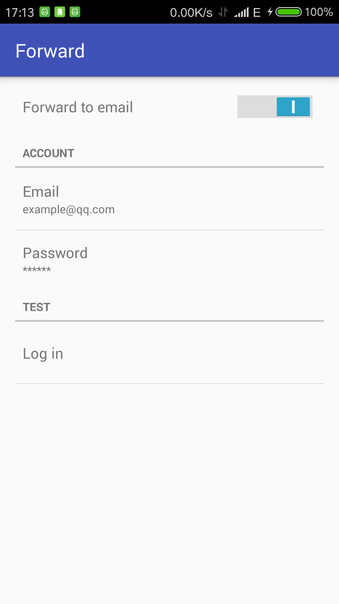

# Forward-android

=========================

# Forward (Android)

A simple application that **Forward** SMS and incoming call to your email.

## Usage

 1. Compile and install
 2. Open app and grant permissions
 3. Switch on Forward and fill in email account

## Note

* Require both permissions together to open the app
* Email account suuport: 163.com or qq.com
* __Passwords__ are stored in plaintext in preferences (not secure)
* Some SMS may be regarded as _SPAM_ and thus the email is **not sent**

## Screenshot

